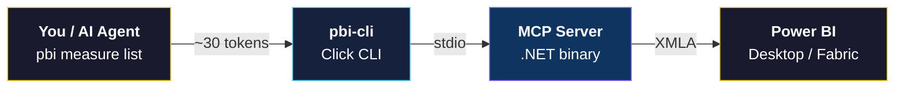
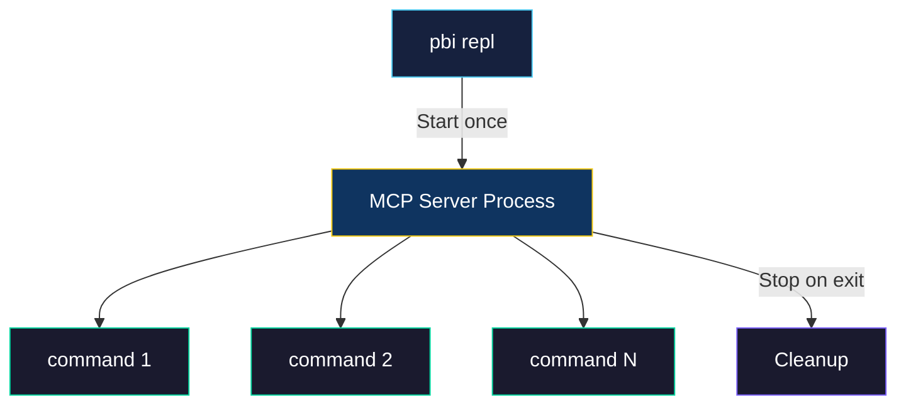
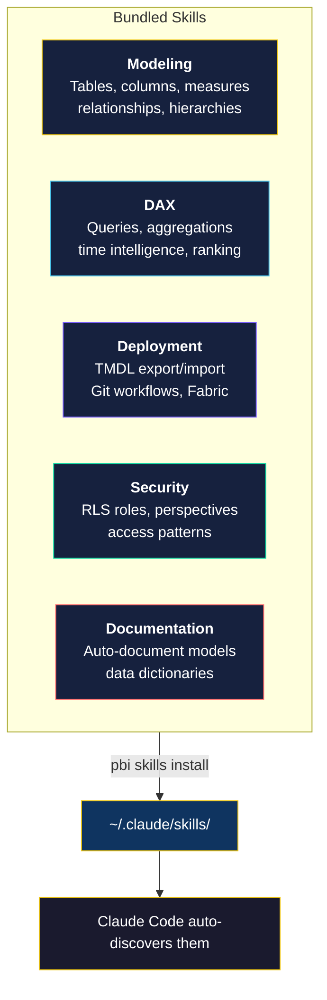
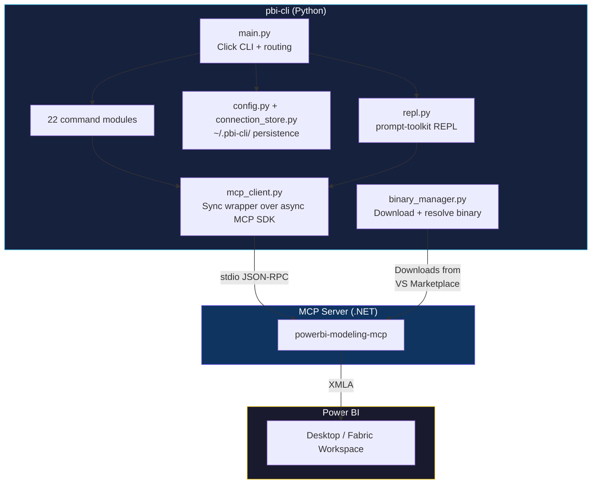

<p align="center">
  
</p>

<p align="center">
  <strong>Manage Power BI semantic models from your terminal.</strong><br/>
  One command instead of 4,000 tokens of MCP schema.
</p>

<p align="center">
  <a href="https://pypi.org/project/pbi-cli-tool/"></a>
  <a href="https://pypi.org/project/pbi-cli-tool/"></a>
  <a href="https://github.com/MinaSaad1/pbi-cli/actions"></a>
  <a href="https://github.com/MinaSaad1/pbi-cli/blob/master/LICENSE"></a>
</p>

<p align="center">
  <a href="#-quick-start">Quick Start</a> &bull;
  <a href="#-commands">Commands</a> &bull;
  <a href="#-repl-mode">REPL Mode</a> &bull;
  <a href="#-ai-agent-skills">AI Skills</a> &bull;
  <a href="#-for-ai-agents">For AI Agents</a> &bull;
  <a href="#-contributing">Contributing</a>
</p>

---

## The Problem

When an AI agent connects to a Power BI MCP server directly, **each tool schema costs ~4,000+ tokens** in the context window. With 20+ tools, that's most of the context gone before any work begins.

pbi-cli wraps the same MCP server behind a CLI. A single command uses **~30 tokens**. Same capabilities, 100x more efficient.

```
                          Context Window Cost
  ┌─────────────────────────────────────────────────────┐
  │ Raw MCP schemas   ████████████████████████  ~4,000  │
  │ pbi-cli command   █                           ~30   │
  └────────────────────────────────���────────────────────┘
```

---

## How It Works



**No separate MCP server configuration needed.** pbi-cli downloads and manages the official Microsoft binary for you.

---

## Quick Start

### 1. Install

```bash
pip install pbi-cli-tool
```

### 2. Download the MCP binary

```bash
pbi setup
```

### 3. Connect and go

```bash
# Local Power BI Desktop
pbi connect --data-source localhost:54321

# Or a Fabric workspace
pbi connect-fabric --workspace "My Workspace" --model "Sales Model"
```

### 4. Start working

```bash
pbi measure list                    # See all measures
pbi dax execute "EVALUATE Sales"    # Run a DAX query
pbi database export-tmdl ./model/   # Export model to files
```

> **Requires:** Python 3.10+ and Power BI Desktop (local) or a Fabric workspace (cloud).

---

## Commands

pbi-cli covers every Power BI MCP server operation across **22 command groups**.

### Data & Queries

| Command | What it does |
|---------|-------------|
| [`pbi dax execute`](#) | Run DAX queries inline, from file, or piped from stdin |
| [`pbi dax validate`](#) | Check DAX syntax without executing |
| [`pbi dax clear-cache`](#) | Clear the formula engine cache for benchmarking |

### Model Structure

| Command | What it does |
|---------|-------------|
| [`pbi table`](#) | Create, list, rename, delete, refresh tables |
| [`pbi column`](#) | Add data columns or calculated columns to tables |
| [`pbi measure`](#) | Full CRUD for measures with DAX expressions and formatting |
| [`pbi relationship`](#) | Create star-schema relationships between tables |
| [`pbi hierarchy`](#) | Build drill-down hierarchies (Year > Quarter > Month) |
| [`pbi calc-group`](#) | Calculation groups for reusable time intelligence |

### Deployment & Lifecycle

| Command | What it does |
|---------|-------------|
| [`pbi database export-tmdl`](#) | Export entire model as human-readable TMDL files |
| [`pbi database import-tmdl`](#) | Deploy TMDL files into a connected model |
| [`pbi database export-tmsl`](#) | Export as TMSL JSON (SSAS/AAS compatible) |
| [`pbi model refresh`](#) | Refresh model data (Full, DataOnly, Calculate, Defragment) |
| [`pbi transaction`](#) | Wrap multiple changes in atomic begin/commit/rollback |

### Security & Governance

| Command | What it does |
|---------|-------------|
| [`pbi security-role`](#) | Create and manage row-level security (RLS) roles |
| [`pbi perspective`](#) | Control which tables/columns different users see |
| [`pbi advanced culture`](#) | Multi-language support with cultures and translations |

### Connections & Config

| Command | What it does |
|---------|-------------|
| [`pbi connect`](#) | Connect to Power BI Desktop via localhost |
| [`pbi connect-fabric`](#) | Connect to Fabric workspace models |
| [`pbi connections list`](#) | View and manage saved named connections |
| [`pbi setup`](#) | Download/update the MCP binary, check status |

<details>
<summary><b>See all remaining commands</b></summary>

| Command | What it does |
|---------|-------------|
| `pbi model get` | View model metadata (name, compatibility level, culture) |
| `pbi model stats` | Table count, measure count, column count at a glance |
| `pbi partition` | Manage table partitions and partition-level refresh |
| `pbi expression` | Named expressions and model parameters |
| `pbi calendar` | Calendar/date table management |
| `pbi trace` | Diagnostic tracing (start, stop, fetch, export) |
| `pbi advanced function` | Model functions |
| `pbi advanced query-group` | Query groups |
| `pbi repl` | Interactive REPL session |
| `pbi skills` | Install AI agent skills for Claude Code |

</details>

Run `pbi <command> --help` for full options on any command.

---

## REPL Mode

Each `pbi` command starts and stops the MCP server process (~2-3 seconds). The **REPL** keeps it running:

```
$ pbi repl
pbi-cli interactive mode. Type 'exit' or Ctrl+D to quit.

pbi> connect --data-source localhost:54321
Connected: localhost-54321

pbi(localhost-54321)> measure list
┌──────────────┬────────────────────────┬────────┐
│ Name         │ Expression             │ Table  │
├──────────────┼────────────────────────┼────────┤
│ Total Sales  │ SUM(Sales[Amount])     │ Sales  │
│ Order Count  │ COUNTROWS(Sales)       │ Sales  │
└──────────────┴────────────────────────┴────────┘

pbi(localhost-54321)> dax execute "EVALUATE TOPN(5, Sales)"
...

pbi(localhost-54321)> exit
Goodbye.
```



**REPL features:**
- Persistent MCP connection (no restart between commands)
- Tab completion for all commands and subcommands
- Command history across sessions (`~/.pbi-cli/repl_history`)
- Dynamic prompt showing your active connection

---

## AI Agent Skills

pbi-cli ships with **5 Claude Code skills** that teach AI agents how to work with Power BI models. Install them once and Claude Code automatically discovers them.

```bash
pbi skills install     # Install all 5 skills
pbi skills list        # Check what's installed
```



| Skill | What the AI agent learns |
|-------|------------------------|
| **Modeling** | Create star schemas, add measures with format strings, build hierarchies and calculation groups |
| **DAX** | Execute queries, write CALCULATE/SUMMARIZECOLUMNS patterns, time intelligence, performance tips |
| **Deployment** | Export/import TMDL for version control, promote dev to production, atomic transactions |
| **Security** | Set up row-level security roles, create perspectives, region/department/manager access patterns |
| **Documentation** | Auto-catalog all model objects, generate data dictionaries, measure inventories, manage translations |

---

## For AI Agents

Add `--json` before any subcommand for machine-readable output:

```bash
pbi --json measure list              # JSON array of all measures
pbi --json dax execute "EVALUATE X"  # Query results as JSON
pbi --json model stats               # Model statistics as JSON
```

**JSON goes to stdout. Status messages go to stderr.** This makes piping and parsing clean:

```bash
pbi --json measure list | jq '.[].name'
```

Use `-c` to target a specific named connection:

```bash
pbi -c dev measure list
pbi -c prod dax execute "EVALUATE Sales"
```

---

## Architecture



### Binary Resolution

pbi-cli finds the MCP server binary in this order:

```
1. $PBI_MCP_BINARY           Environment variable (explicit override)
          |
          v
2. ~/.pbi-cli/bin/{version}/  Managed by `pbi setup`
          |
          v
3. ~/.vscode/extensions/      VS Code extension fallback
```

### Configuration

All config lives in `~/.pbi-cli/`:

```
~/.pbi-cli/
  config.json          # Binary version, path, args
  connections.json     # Named connections
  repl_history         # REPL command history
  bin/
    {version}/
      powerbi-modeling-mcp[.exe]
```

---

## Development

```bash
git clone https://github.com/MinaSaad1/pbi-cli.git
cd pbi-cli
pip install -e ".[dev]"
```

```bash
ruff check src/ tests/         # Lint
mypy src/                      # Type check
pytest -m "not e2e"            # Run 120 tests
pytest -m "not e2e" --cov      # With coverage
```

### Project Structure

```
src/pbi_cli/
  main.py                 # CLI entry point, context, command registration
  commands/               # 22 command modules (one per group)
    _helpers.py           # Shared run_tool() and build_definition()
  core/
    mcp_client.py         # Sync MCP client wrapper
    binary_manager.py     # Binary download and resolution
    config.py             # Configuration persistence
    connection_store.py   # Named connection management
    errors.py             # User-facing error hierarchy
    output.py             # Dual output (JSON + Rich)
  utils/
    repl.py               # Interactive REPL
    platform.py           # OS/arch detection
  skills/                 # 5 bundled Claude Code skills
```

---

## Contributing

Contributions are welcome! Please open an issue first to discuss what you'd like to change.

1. Fork the repository
2. Create a feature branch (`git checkout -b feature/my-change`)
3. Make your changes with tests
4. Run `ruff check` and `mypy` before submitting
5. Open a pull request

---

<p align="center">
  <a href="https://github.com/MinaSaad1/pbi-cli"></a>
  <a href="https://pypi.org/project/pbi-cli-tool/"></a>
</p>

<p align="center">
  <sub>MIT License &bull; Built for Power BI developers and AI agents</sub>
</p>
