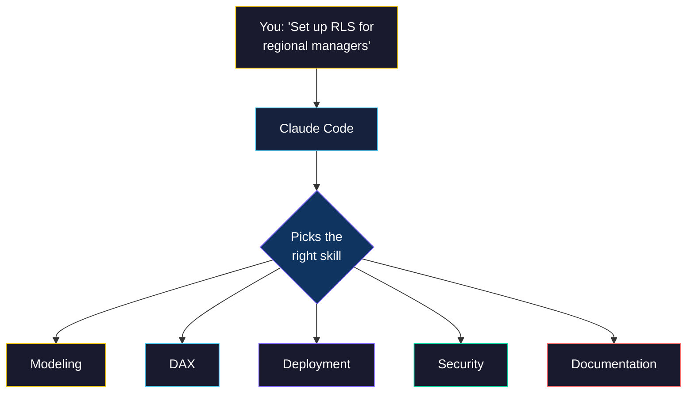
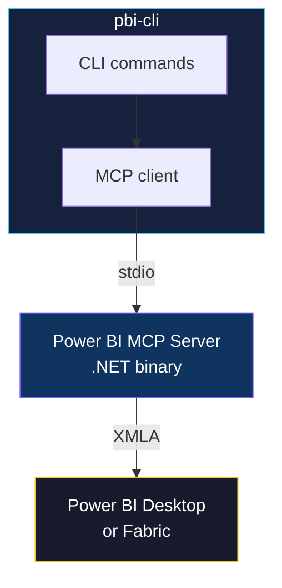

**Give Claude Code the Power BI skills it needs.**
Install once, then just ask Claude to work with your semantic models.

<a href="https://pypi.org/project/pbi-cli-tool/"></a>
<a href="https://github.com/MinaSaad1/pbi-cli/actions"></a>
<a href="https://github.com/MinaSaad1/pbi-cli/blob/master/LICENSE"></a>

[Get Started](#get-started) &bull; [Skills](#skills) &bull; [All Commands](#all-commands) &bull; [REPL Mode](#repl-mode) &bull; [Contributing](#contributing)

---

## What is this?

pbi-cli gives **Claude Code** (and other AI agents) the ability to manage Power BI semantic models. It ships with 5 skills that Claude discovers automatically. You ask in plain English, Claude uses the right `pbi` commands.


---

## Get Started

**Fastest way:** Just give Claude the repo URL and let it handle everything:

```
Install and set up pbi-cli from https://github.com/MinaSaad1/pbi-cli.git
```

**Or install manually (two commands):**

```bash
pipx install pbi-cli-tool    # 1. Install (handles PATH automatically)
pbi connect                  # 2. Auto-detects Power BI Desktop, downloads binary, installs skills
```

That's it. Open Power BI Desktop with a `.pbix` file, run `pbi connect`, and everything is set up automatically. Open Claude Code and start asking.

You can also specify the port manually: `pbi connect -d localhost:54321`

> **Requires:** Python 3.10+ and Power BI Desktop (local) or a Fabric workspace (cloud).

<details>
<summary><b>Using pip instead of pipx?</b></summary>

```bash
pip install pbi-cli-tool
```

On Windows, `pip install` often places the `pbi` command in a directory that isn't on your PATH.

**Fix: Add the Scripts directory to PATH**

Find the directory:
```bash
python -c "import site; print(site.getusersitepackages().replace('site-packages','Scripts'))"
```

Add the printed path to your system PATH:
```cmd
setx PATH "%PATH%;C:\Users\YourName\AppData\Roaming\Python\PythonXXX\Scripts"
```

Then **restart your terminal**. We recommend `pipx` instead to avoid this entirely.

</details>

---

## Skills

After running `pbi skills install`, Claude Code discovers **5 Power BI skills**. Each skill teaches Claude a different area of Power BI development. You don't need to memorize commands. Just describe what you want.



### Modeling

> *"Create a star schema with Sales, Products, and Calendar tables"*

Claude creates the tables, sets up relationships, marks the date table, and adds formatted measures. Covers tables, columns, measures, relationships, hierarchies, and calculation groups.

<details>
<summary>Example: what Claude runs behind the scenes</summary>

```bash
pbi table create Sales --mode Import
pbi table create Products --mode Import
pbi table create Calendar --mode Import
pbi relationship create --from-table Sales --from-column ProductKey --to-table Products --to-column ProductKey
pbi relationship create --from-table Sales --from-column DateKey --to-table Calendar --to-column DateKey
pbi table mark-date Calendar --date-column Date
pbi measure create "Total Revenue" -e "SUM(Sales[Revenue])" -t Sales --format-string "$#,##0"
```
</details>

### DAX

> *"What are the top 10 products by revenue this year?"*

Claude writes and executes DAX queries, validates syntax, and creates measures with time intelligence patterns like YTD, previous year, and rolling averages.

<details>
<summary>Example: what Claude runs behind the scenes</summary>

```bash
pbi dax execute "
EVALUATE
TOPN(
    10,
    ADDCOLUMNS(VALUES(Products[Name]), \"Revenue\", CALCULATE(SUM(Sales[Amount]))),
    [Revenue], DESC
)
"
```
</details>

### Deployment

> *"Export the model to Git and deploy it to the Staging workspace"*

Claude exports your model as TMDL files for version control, then imports them into another environment. Handles transactions for safe multi-step changes.

<details>
<summary>Example: what Claude runs behind the scenes</summary>

```bash
pbi database export-tmdl ./model/
# ... you commit to git ...
pbi connect-fabric --workspace "Staging" --model "Sales Model"
pbi database import-tmdl ./model/
pbi model refresh --type Full
```
</details>

### Security

> *"Set up row-level security so regional managers only see their region"*

Claude creates RLS roles with descriptions, sets up perspectives for different user groups, and exports role definitions for version control.

<details>
<summary>Example: what Claude runs behind the scenes</summary>

```bash
pbi security-role create "Regional Manager" --description "Users see only their region's data"
pbi perspective create "Executive Dashboard"
pbi perspective create "Regional Detail"
pbi security-role export-tmdl "Regional Manager"
```
</details>

### Documentation

> *"Document everything in this model"*

Claude catalogs every table, measure, column, and relationship. Generates data dictionaries, measure inventories, and can export the full model as TMDL for human-readable reference.

<details>
<summary>Example: what Claude runs behind the scenes</summary>

```bash
pbi --json model get
pbi --json model stats
pbi --json table list
pbi --json measure list
pbi --json relationship list
pbi database export-tmdl ./model-docs/
```
</details>

---

## All Commands

22 command groups covering every Power BI MCP server operation. You rarely need these directly when using Claude Code, but they're available for scripting, CI/CD, or manual use.

| Category | Commands |
|----------|----------|
| **Queries** | `dax execute`, `dax validate`, `dax clear-cache` |
| **Model** | `table`, `column`, `measure`, `relationship`, `hierarchy`, `calc-group` |
| **Deploy** | `database export-tmdl`, `database import-tmdl`, `database export-tmsl`, `model refresh`, `transaction` |
| **Security** | `security-role`, `perspective` |
| **Connect** | `connect`, `connect-fabric`, `disconnect`, `connections list` |
| **Other** | `partition`, `expression`, `calendar`, `trace`, `advanced`, `model get`, `model stats` |
| **Tools** | `setup`, `repl`, `skills install`, `skills list` |

Use `--json` for machine-readable output (for scripts and AI agents):

```bash
pbi --json measure list
pbi --json dax execute "EVALUATE Sales"
```

Run `pbi <command> --help` for full options.

---

## REPL Mode

For interactive work, the REPL keeps the MCP server running between commands (skipping the ~2-3s startup each time):

```
$ pbi repl

pbi> connect --data-source localhost:54321
Connected: localhost-54321

pbi(localhost-54321)> measure list
pbi(localhost-54321)> dax execute "EVALUATE TOPN(5, Sales)"
pbi(localhost-54321)> exit
```

Tab completion, command history, and a dynamic prompt showing your active connection.

---

## How It Works

pbi-cli wraps Microsoft's official Power BI MCP server binary behind a CLI. The binary is downloaded automatically on first `pbi connect` from the VS Code Marketplace.



**Why a CLI wrapper?** When an AI agent uses an MCP server directly, the tool schemas consume ~4,000+ tokens per tool in the context window. A `pbi` command costs ~30 tokens. Same capabilities, 100x less context.

<details>
<summary><b>Configuration details</b></summary>

All config lives in `~/.pbi-cli/`:

```
~/.pbi-cli/
  config.json          # Binary version, path, args
  connections.json     # Named connections
  repl_history         # REPL command history
  bin/{version}/       # MCP server binary
```

Binary resolution order:
1. `$PBI_MCP_BINARY` env var (explicit override)
2. `~/.pbi-cli/bin/` (auto-downloaded on first connect)
3. VS Code extension fallback

</details>

---

## Development

```bash
git clone https://github.com/MinaSaad1/pbi-cli.git
cd pbi-cli
pip install -e ".[dev]"
```

```bash
ruff check src/ tests/         # Lint
mypy src/                      # Type check
pytest -m "not e2e"            # Run 120 tests
```

---

## Contributing

Contributions are welcome! Please open an issue first to discuss what you'd like to change.

1. Fork the repository
2. Create a feature branch
3. Make your changes with tests
4. Open a pull request

---

<p align="center">
  <a href="https://github.com/MinaSaad1/pbi-cli"></a>
  <a href="https://pypi.org/project/pbi-cli-tool/"></a>
</p>

<p align="center">
  <sub>MIT License</sub>
</p>
